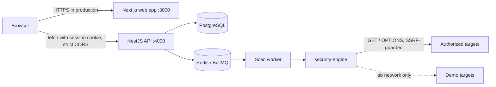

# SentinelLab

SentinelLab is a web app for running security checks against applications you own or have written permission to test. You register a target, confirm you are authorized to test it, start a scan, triage the findings, and download a report.

It ships with two intentionally vulnerable demo apps that run only on your machine, so you can see real results without pointing the scanner at anyone else's system.

> SentinelLab runs automated, mostly passive checks. A clean scan does not mean an application is secure.

## What it does

- **Dashboard.** Scan counts, open findings by severity, recent findings, target health and scan history. Every number comes from your own data; with no data you see an empty state, not sample numbers.
- **Targets.** Create, edit, disable and delete targets. A target can't be scanned until you confirm you are authorized to test it, and changing its URL clears that confirmation.
- **Scans.** Scans run in the background on a Redis queue. You can watch progress per module, cancel a scan, and browse the history.
- **Findings.** Each finding has a severity, confidence, endpoint, description, impact, remediation, references and redacted evidence. You can mark it Open, Confirmed, False Positive, Resolved or Accepted Risk. False positives and accepted risks carry over to later scans of the same issue.
- **Reports.** Markdown or HTML reports with executive summary, scope, methodology, scan information, findings, severity breakdown, evidence, remediation and conclusion. Print the HTML report to get a PDF.
- **Demo Lab.** One click adds a local demo target and starts a scan.
- **Audit log.** Sign-ins, target changes, scans, triage decisions and report generation, without passwords or tokens.

### Checks in this version

| Module | Looks for |
| --- | --- |
| `security-headers` | Missing CSP, clickjacking protection, HSTS, `nosniff`, Referrer-Policy |
| `cookie-security` | Cookies without HttpOnly, Secure or SameSite |
| `transport` | Plain HTTP without a redirect to HTTPS |
| `cors` | Origin reflection (with or without credentials), wildcards |
| `information-disclosure` | Version numbers in `Server`, `X-Powered-By` and similar headers |
| `http-methods` | TRACE and write methods advertised by OPTIONS |
| `error-handling` | Stack traces and SQL errors in responses |
| `rate-limiting` | Missing rate limit headers (informational only) |

A scan sends at most nine requests, all GET or OPTIONS. See [docs/SCANNER.md](docs/SCANNER.md) for the exact traffic, severities and what is not covered yet.

## Architecture



| Path | What lives there |
| --- | --- |
| `apps/web` | Next.js 16 dashboard (TypeScript, Tailwind CSS 4) |
| `apps/api` | NestJS 11 API, Prisma schema and migrations, scan worker |
| `packages/security-engine` | Recon, checks, normalization, SSRF guard, redaction |
| `packages/types` | Enums shared by the API and the web app |
| `packages/config` | Shared TypeScript and ESLint settings |
| `targets/` | The two intentionally vulnerable demo apps |
| `infrastructure/docker` | Dockerfiles for the API and web app |
| `tests/` | Playwright end-to-end tests |
| `docs/` | Architecture, security, scanner and development guides |

More detail: [docs/ARCHITECTURE.md](docs/ARCHITECTURE.md).

## Tech stack

Next.js 16, React 19, Tailwind CSS 4, NestJS 11, Prisma 6, PostgreSQL 16, Redis 7 with BullMQ, TypeScript 5.9, Jest, Supertest, Playwright, Docker Compose and GitHub Actions.

## Quick start with Docker

You need Docker with Compose v2.

```bash
git clone https://github.com/work-frame/sentinellab.git
cd sentinellab
cp .env.example .env            # then change POSTGRES_PASSWORD
docker compose up -d --build
```

Open http://localhost:3000, create an account (the first account becomes the admin), go to **Demo Lab**, add `vulnerable-web` and click **Scan now**. The first build takes a few minutes.

Swagger UI is at http://localhost:4000/api/docs.

Everything binds to `127.0.0.1`. The demo targets run on an internal Docker network that only the API can reach, and they have no internet access.

To stop: `docker compose down`. Add `-v` to also delete the database volume.

## Local development

You need Node.js 22, pnpm 10 (`corepack enable`) and Docker.

```bash
pnpm install
cp .env.example .env
docker compose -f docker-compose.dev.yml up -d   # Postgres, Redis, demo targets on 127.0.0.1
pnpm db:migrate
pnpm dev                                          # API on :4000, web on :3000
```

[docs/DEVELOPMENT.md](docs/DEVELOPMENT.md) covers the scripts, the database workflow and debugging tips.

## Environment variables

`.env.example` lists every variable with a comment. The ones you are most likely to change:

| Variable | Default | Purpose |
| --- | --- | --- |
| `DATABASE_URL` | none (required) | PostgreSQL connection string |
| `REDIS_URL` | `redis://localhost:6379` | Queue backend |
| `WEB_ORIGIN` | `http://localhost:3000` | The only origin allowed by CORS and the CSRF check |
| `NEXT_PUBLIC_API_URL` | `http://localhost:4000` | API URL used by the browser, baked in at build time |
| `COOKIE_SECURE` | `true` in production | Set the session cookie's Secure flag. Needs HTTPS |
| `DEMO_TARGETS` | the two local demo apps | `key=url` pairs; their host:port are the only local addresses the scanner may reach |
| `TRUST_PROXY` | off | Set only behind a reverse proxy that overwrites `X-Forwarded-For` |
| `ALLOW_REGISTRATION` | `true` | Turn off public sign-up |

Never commit `.env`. It is in `.gitignore`.

## Running tests

| Command | What it runs | Needs |
| --- | --- | --- |
| `pnpm test` | Unit tests: engine (58), API (4), web components (14) | nothing |
| `pnpm test:integration` | 34 API tests against real Postgres and Redis: auth, IDOR, SSRF, CSRF, rate limits, scans, reports | dev compose running |
| `pnpm test:e2e` | 7 Playwright tests through the browser | full stack running |
| `pnpm lint`, `pnpm typecheck` | ESLint and TypeScript | nothing |
| `pnpm audit` | Production dependency advisories (high and above) | network |

Integration tests use a separate database whose name ends in `_test`. They apply migrations with `prisma migrate deploy` and never reset or drop anything.

For the end-to-end suite, start the stack with a higher sign-up limit, because every test registers a new user from the same IP:

```bash
REGISTER_RATE_LIMIT=100 docker compose up -d --build
pnpm test:e2e
```

CI runs all of the above on every push and pull request, plus CodeQL and Docker image builds.

## Running the demo targets

The demo apps live in [`targets/`](targets/README.md). Every page carries the banner **INTENTIONALLY VULNERABLE — LOCAL SECURITY TRAINING TARGET**. They hold no data and use only Node.js built-ins.

- With the full stack they start automatically on the internal lab network.
- With the dev compose file they listen on `127.0.0.1:8081` (web) and `127.0.0.1:8082` (API).

Never deploy them or expose them to a network.

## Running a scan

1. Add a target under **Targets**, or use the **Demo Lab**.
2. Tick the authorization box to confirm you own the application or have written permission.
3. Click **Start scan**. The scan page refreshes on its own while the scan runs.
4. Open a finding to read the evidence and remediation, then set its status.
5. On a completed scan, choose **Markdown report** or **HTML report**.

The API refuses target URLs that resolve to private, loopback, link-local or other reserved addresses. The configured demo targets are the only exception, and only for their exact host and port.

## Security limitations

Read these before you rely on SentinelLab:

- The checks are passive configuration checks. SentinelLab does not yet test for injection, broken authorization or authentication flaws, and it never logs in to the target.
- The rate limit check only reads headers. It does not send bursts of traffic.
- The web app's CSP allows inline scripts, because Next.js needs them without a nonce setup. React escaping and the absence of raw HTML rendering are the main XSS defenses.
- Rate limits are stored in memory per API process. Run one API instance, or move the limiter to Redis before scaling out.
- Logging out ends the current session only. There is no "sign out everywhere" yet.
- Account lockout (10 failures, 15 minutes) stops password guessing but lets someone who knows an email address lock that account temporarily.

[docs/SECURITY.md](docs/SECURITY.md) has the threat model and the full list of controls. To report a vulnerability in SentinelLab itself, see [SECURITY.md](SECURITY.md).

## Contributing

See [CONTRIBUTING.md](CONTRIBUTING.md). In short: one focused change per pull request, tests for new behavior, and never a check that sends destructive or state-changing requests.

## License

[MIT](LICENSE)
