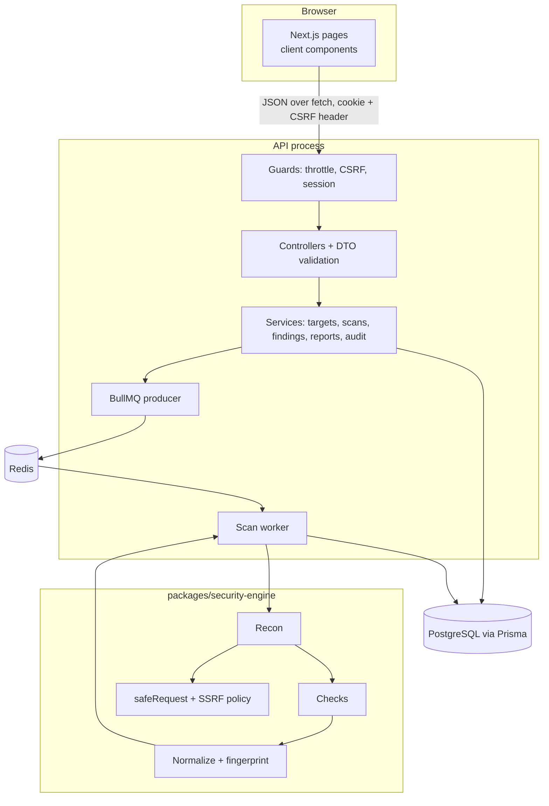
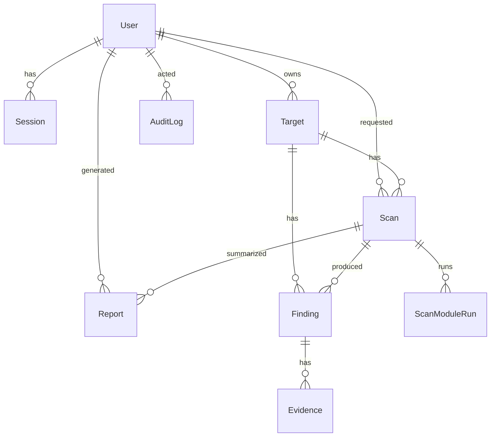
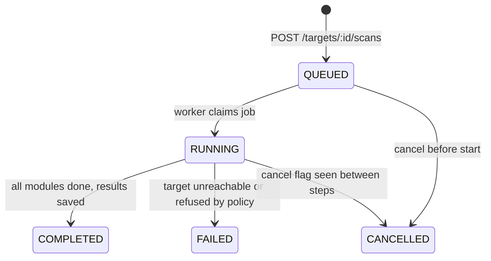

# Architecture

SentinelLab is a pnpm monorepo with two apps, three shared packages and two demo targets. This page explains how the pieces fit and why they are split the way they are.

## Components



### apps/web

Next.js 16 with the App Router. Every page is a client component that calls the API with `fetch` (`lib/api.ts`). The browser talks to the API origin directly instead of through a Next.js proxy, so the API sees the real client address for rate limiting and audit logs. `lib/use-api.ts` is a small data hook with polling for live scan progress.

Pages: dashboard, targets (list, new, detail), scans (list, detail), findings (list, detail), reports, demo lab, settings, login, register.

### apps/api

NestJS 11 with one module per area:

| Module | Responsibility |
| --- | --- |
| `auth` | Register, login, logout, `me`; session guard |
| `targets` | CRUD, authorization confirmation, URL validation |
| `scans` | Queue, cancel, list, detail; `ScanRunnerService` and the BullMQ processor |
| `findings` | List, detail with evidence, status changes |
| `reports` | Generate Markdown/HTML, list, download |
| `dashboard` | Aggregated numbers for the signed-in user |
| `audit` | `AuditService.record()` and the audit log endpoint |
| `demo` | Lists configured demo targets and adds them for a user |
| `health` | Database and Redis check |

Three global guards run on every request, in this order: rate limit (`ThrottlerGuard`), CSRF (`CsrfGuard`), session (`SessionGuard`). Routes opt out of the session guard with `@Public()`. A global exception filter turns every error into a short JSON body and keeps stack traces in the server log.

`bootstrap.ts` holds the HTTP setup (helmet, CORS, validation pipe, Swagger) and is shared by `main.ts` and the integration tests, so tests exercise the same configuration as production.

### packages/security-engine

Pure TypeScript with no NestJS or database code, so every part is testable on its own.

```
Scanner (runScan)
  -> Recon (runRecon: baseline GET, same-host redirects, OPTIONS, not-found GET, CORS probe)
  -> HTTP analysis (each check reads the recon result)
  -> Security checks (8 modules, pure functions)
  -> Finding normalization (dedupe by fingerprint, sort by severity)
  -> Severity classification (fixed per rule)
  -> Evidence (redacted request/response excerpts)
  -> returned to the API, which writes it to the database and builds reports
```

Checks never make network calls. They receive a `ReconResult` and return `FindingDraft[]`. That keeps the number of requests predictable and makes unit tests simple: build a fixture, call `check.run()`.

### packages/types

String enums for severity, confidence, finding status, scan status and environment, plus their labels. The Prisma schema declares the same values.

### targets/

Two dependency-free Node.js servers with deliberate misconfigurations. See [targets/README.md](../targets/README.md).

## Data model



Notes:

- `Session.tokenHash` stores SHA-256 of the session token. A database leak does not reveal usable sessions.
- `Scan.targetUrl` snapshots the URL at queue time, so editing a target never rewrites history.
- `Finding.fingerprint` identifies the same issue across scans. Triage decisions of False Positive and Accepted Risk carry over through it.
- `AuditLog.actorId` is nullable so failed logins for unknown emails can be logged.
- Indexes cover the common filters: findings by target and status, by severity and date; scans by target and date, by status; audit logs by actor and date.

## Scan lifecycle



1. The API validates ownership, the enabled flag, the authorization confirmation and the URL (with a fresh DNS lookup), then creates the scan and adds a BullMQ job whose id is the scan id. A transaction prevents a second active scan for the same target.
2. The worker claims the scan with a conditional update (`QUEUED` to `RUNNING`). If the user cancelled first, the claim fails and the job ends.
3. While the engine runs, the worker polls the `cancelRequested` flag every 500 ms and aborts through an `AbortSignal`. Progress and module status are written after each step.
4. Findings, evidence, module results and the final status are written in one transaction.
5. On startup the API marks scans stuck in `RUNNING` for more than 30 minutes as failed.

The worker runs inside the API process (concurrency 2). Moving it to its own process only needs a second entry point that imports `ScansModule`.

## Request flow example

`PATCH /api/findings/:id/status`

1. `ThrottlerGuard` counts the request against the client IP.
2. `CsrfGuard` requires `X-SentinelLab-CSRF: 1` and an allowed `Origin`.
3. `SessionGuard` hashes the cookie token, loads the session and attaches the user.
4. `ParseUUIDPipe` and the DTO validation reject malformed input; unknown fields are refused.
5. `FindingsService.get` loads the finding only where `target.ownerId` is the current user, so another user's id returns 404.
6. The update runs, and `AuditService` records `finding.status_changed` with the old and new status.

## Deployment shape

`docker-compose.yml` runs six containers on three networks:

| Network | Members | Internet |
| --- | --- | --- |
| `edge` | web, api | yes, ports published on 127.0.0.1 |
| `data` | api, postgres, redis | no (internal) |
| `lab` | api, vulnerable-web, vulnerable-api | no (internal) |

App containers run as the `node` user with a read-only filesystem, no Linux capabilities and `no-new-privileges`.

For a real deployment you would put both apps behind HTTPS, set `COOKIE_SECURE=true`, set `WEB_ORIGIN` and `NEXT_PUBLIC_API_URL` to the real URLs, remove the demo targets and turn off `ALLOW_REGISTRATION` once your accounts exist.
